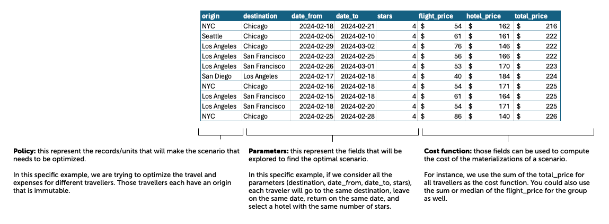

# _What-if?_ Scenario planner tool

If you are looking for how to use the library, please read the [how-to guide](./HOWTO.md) to get stated quickly!

## Description

This repository contains the code for the `what-if` package that allows users to optimize the decisions made on a dataset based on a given scenario. The library accomodates multiple data sets and scenarios.

1. **01-travel-and-expense-multiple-travelers.py**

    Description: The script demonstrates a method for optimizing travel expenses by preprocessing travel data, setting up travel policies, and using optimization functions to find the best travel options considering multiple travelers from different origins. The flexibility around departure and return dates is taken into account in the optimization process.

2. **02-hc-expenses-multiple-records-same-team.py**

    Description: This script optimizes expenses for onboarding multiple sub-teams in different cities. It preprocesses human capital data, sets up policies for different team sizes, and uses an optimization function to find the best cities considering the office capacity and cost constraints.    

3. **brute_force_general.py**

    Description: This module contains the core logic for performing brute-force optimizations. It implements methods to filter and process data according to specified policies and filters, and iterates over potential scenarios to identify optimal configurations. Functions include merging data with policies, enforcing filters, and aggregating results based on cost criteria. This is the backbone of the optimization engine, integrating with KeepN from keep_n.py to store and manage top results.

4. **keep_n.py**

    Description: Provides a custom data structure designed to maintain a list of the top N results from optimization processes, prioritizing low-cost solutions. It includes methods for adding new results, cleaning the list to retain only the most relevant entries, and retrieving the final sorted list of top results. This module is vital for performance optimization, ensuring memory efficiency and operational speed during large-scale data evaluations.

5. **param_utils.py**

    Description: Supplies utility functions for date manipulation and range generation critical to the optimization process. Functions allow for the creation of flexible date ranges around a given base date, supporting the dynamic adjustment of time frames within optimization scenarios. This module is instrumental in handling date-related parameters, providing robust support for time-sensitive decision-making in optimization tasks.

6. **brute_force_general_test.py**

    Description: Contains unit tests for the functions in brute_force_general.py. It ensures that the core optimization functions work correctly by verifying data processing, filtering, and scenario enumeration. Tests include checking the merging of scenario parameters with policies, applying cost functions, and keeping only relevant records.

7. **json_utils_test.py**

    Description: This test file verifies the functionality of JSON utility functions. It ensures that JSON data is correctly read from and written to files, and that data integrity is maintained throughout the process. The tests include handling various edge cases and data formats.

8. **keep_n_test.py**

    Description: This test file verifies the functionality of the KeepN class from the what_if package. The tests ensure that:
    An empty KeepN instance returns an empty list.
    A KeepN instance filled only with infinite values returns an empty list.
    A KeepN instance with fewer than 'N' items returns all items.
    A KeepN instance with more than 'N' items correctly retains only the top 'N' items based on cost.
    The constructor of KeepN raises a ValueError if initialized with a negative 'N'.

9. **param_utils_test.py**

    Description: Tests in this file validate the functions within the param_utils.py module, specifically focusing on date range generation:
    Ensuring that the function date_range creates a date list extending 'n' days before and after a given date, inclusive.
    Verifying that the length of the range is always 2n + 1, representing a symmetric range around the base date.
    Confirming that passing a negative flex value to date_range raises a ValueError.

10. **scenarios_test.py**

    Description: This script tests the scenario-based optimization processes defined in the what_if package. It ensures that:
    The total cost calculated from optimization matches expected values for various scenarios.
    Dataframes returned by the optimization process are properly structured and contain the expected 'total_cost' column.
    The optimization function integrates all parts of the process, including data preparation, applying filters, and executing the optimization, to provide accurate results.


## Installation

- This library use [Poetry](https://python-poetry.org/) as a package management. 
 
- To use Go-Finv, follow these steps:
    - Clone the repository:
    ```
    git clone https://gitpct.epam.com/go2-finv/what-if.git
    ```
    - Navigate to the project directory:
    ```
    cd what_if
    ```
    - Install dependencies and set up the virtual environment with Poetry:
    ```
    poetry install
    ```
    - Activate the virtual environment created by Poetry:
    ```
    poetry shell
    ```
    - Build source files and grab the resulting wheel from the `dist/` directory:
    ```
    poetry build
    ```
    - evaluate pytest files:
    ```
    poetry run pytest 
    ```
    - Evaluate the file brute_force_general:
    ```
    poetry run pytest .\src\tests\brute_force_general_test.py
    ```
    - Evaluate the file json_utils_test:
    ```
    poetry run pytest .\src\tests\json_utils_test.py
    ```
    - Evaluate the file keep_n:
    ```
    poetry run pytest .\src\tests\keep_n_test.py
    ```
    - Evaluate the file param_utils.py:
    ```
    poetry run pytest .\src\tests\param_utils_test.py
    ```
    - Run the tests to evaluate the minimum value of the total_cost for all scenarios:
    ```
    poetry run pytest .\src\tests\scenarios_test.py
    ```
    - Run the optimize to evaluate total_cost for demo travel expenses by preprocessing travel data :
    ```
    poetry run python demos/01-travel-and-expense-multiple-travelers.py
    ``` 
    - Run the optimize to evaluate total_cost for demo multiple sub-teams in different cities :
    ```
    poetry run python demos/02-hc-expenses-multiple-records-same-team.py
    ```
   
    > **Note:** 
    In the python file brute_force_run you can modify the input json file you want to evaluate and observe the output list with the result of the recommendation(s) for the input json specification(s) (possible scenarios from 1 to 7, see json in scenarios folder).
    If you need to change or modify any of the scenario values, edit the test_scenarios file located in the src/tests/scenarios_test.py folder or add a new scenario.

## Usage

The library uses [pdoc3](https://pdoc3.github.io/pdoc/) for public documentation. The documentation can be generated using `pdoc --html --output-dir html what-if`.

The primary function of the package is the `optimize()` function, which takes the following parameters.

`df`: A pandas DataFrame which contains the information necessary for the optimization routine.

`parameters`: a list of strings refering to columns that will be explored as part of the optimization routine.

`policies`: a list of dictionaries which represent the records we want to optimize. The keys maps to fields for optimization and the values are values that will be used for matching in the data set.

**Important (v1):** all the dictionaries must have the same keys.

**Important:**  at least _one of the keys_ must match a column of the data frame as it is being used to refer to the records in the data set. This is how the optimization routine ties the policies to the records in the data set.

`filters`: a dictionary containing the filters inputed as part of the optimization. The keys must map to one of the columns of the data set `df`. The values are either a scalar value or a list of values. The optimization routine will only consider the records that fill all the filters.

`target_calculation`: a function that takes the resulting scenario as an input and returns a single cost (floating-point number). This allows for arbitrary cost functions to be applied, allowing for various scenario to be operated through the same function.

`top_n`: an integer that directs how many records will be returned as part of the optimization routine.

The concepts are represented in the data frame like so.




## Dataframe Description df for T&E spend
- File Name: "sample_tne_data_flights_and_hotel_combined.csv"

- General Description: This dataset combines flight and hotel booking data to facilitate comprehensive travel optimization scenarios. It is designed to support decision-making processes by providing critical travel details that can be analyzed and optimized according to various parameters, constraints, and filters.

**Key Features**
Scenario generation based on user input parameters (origin, travel dates, destination, etc.).
Calculation of total cost for each scenario with a breakdown by categories.
Comparison of potential savings across scenarios.
Optimization recommendations for T&E spend.

**Input Parameters**
Travel Dates: The planned dates for travel.
Destination: The target location for travel.
Hotel Preferences: Accommodation preferences, including hotel stars and amenities.
Transportation Preferences: Preferences for modes of transport.
Other Expenses: Additional costs associated with travel.
Number of People: The total number of travelers.

**Optmization Goals**
Minimize Total Costs: Reduce the overall expenses associated with flights and hotels while considering inflation and other dynamic factors.
Adhere to filters and constraints: Respect given business limitations including travel dates, destinations, and the number of travelers.

### Columns and Descriptions:
- Column Name: origin
Description: The departure city or airport code for the flight.
Data Type: String
- Column Name: destination
Description: The arrival city or airport code for the flight.
Data Type: String
- Column Name: date_from
Description: The departure date for the flight.
Data Type: Date
- Column Name: date_to
Description: The return date for the flight.
Data Type: Date
- Column Name: price
Description: The total price for the flight and hotel package.
Data Type: Numeric
- Column Name: travelers
Description: The number of travelers for whom the booking is made.
Data Type: Integer
- Column Name: flight_number
Description: The flight number associated with the booking.
Data Type: String
- Column Name: hotel_rating
Description: The star rating of the hotel included in the booking.
Data Type: Numeric
- Column Name: amenities
Description: A list of amenities provided by the hotel.
Data Type: String
- Column Name: total_price
Description: The total price calculated based on the number of travelers and the price per package.
Data Type: Numeric

### The mental model of the `optimize()` routine

The `optimize()` routine is structured in a way to accomodate different scenarios without needing extensive code modification. When applying a scenario to a data frame, you need to take into consideration three primary concepts.

For this section, we will take a different use-case (_We wish to onboard new employees. Which single location should be relocate them to?_). Let's assume a data frame of the following shape.

``` python
# df
#  |- team: string (name of the team for the table. For this example, will be the same ("blue") for every record.)
#  |- office_location: string (Location of the office. Either "NYC", "CHI", or "LAX")
#  |- total_capacity: integer (How many employees can work from that location?)
#  |- current_allocation: integer (How many employees are currently working from that location?)
#  |- employee_cost: float (how many does it cost to onboard one new employee in that new location?)
```

The **policy**, which is the situation you want to optimize for. In this case, we want to onboard 7 new employees on team "blue" and select the best office for them. In this case, our policy would be `[{"team": "blue", "quantity": 7}]`.

Let's assume that the `LAX` location isn't possible because of business limitations. The **filters** would be `{"office_location": ["CHI", "NYC"]}`. We provide the filters in a positive fashion (what is allowable), and not what is prohibited.

The **parameters** are the variables we want to explore to optimize the scenario. In this case, the only parameter would be `["office_location"]`.

Finally, the cost function needs to account that any office that'd be over capacity after allocation would not be usable. Because of this, we can give a cost of `inf` (infinity) to the scenarios that are not possible. Since the `optimize()` routine accepts a cost _function_, we can write one. The function needs to take a data frame as a parameter and return a cost as a floating point number.

``` python
def rews_optim(df):
    if (df["total_capacity"] >= (df["current_allocation"] + df["quantity"])).all():
        return (df["quantity"] * df["employee_cost"]).sum()
    else:
        return float("inf")
```

The `what-if` library has a few common cost functions provided for often-seen scenarios.
